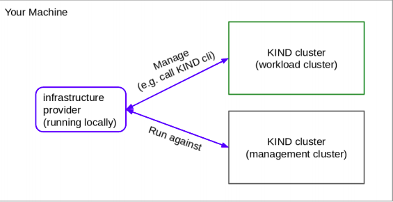

# cluster-api-provider-kind

This is a provider which creates a KIND cluster on your local machine when a KINDCluster custom resource is created.

Please see the following document for detailed infromation about cluster-api: https://cluster-api.sigs.k8s.io/introduction.html

Please see the following document for detailed infromation how an infrastructure provider can be
implemented: https://cluster-api.sigs.k8s.io/developer/providers/implementers-guide/overview.html

Please see the following document for detailed information about the Kubernetes API Extension (with kubebuilder): https://book.kubebuilder.io/introduction.html

## Requirements

- When a KINDCluster custom resource is submitted to a cluster, the infrastructure provider should ensure that a matching KIND cluster is created.
- The custom resource should specify the KIND cluster name, and a ready boolean in the status which should be set to true once the KIND cluster is ready.
-When the Custom Resource is removed, the KIND cluster should be removed too.
- (OPTIONAL) Implement as much of the infrastructure provider specification as possible.

- Note 1: There is not any implement about machines in infrastructure provider

- Note 2: It may be difficult to create a KIND cluster from a container running inside a KIND cluster. Therefore the provider runs in locally with a remote connection.

## High-Level Architecture

Here is how the system works from the high level. You can see three boxes in the figure. Here's what they are:

- Infrastructure Provider: This is actually the provider itself and the source code is in this repo. It is a kubernetes operator with a single controller. It works against Management Cluster and provisioned Workload Clusters on your local machine.

- Management Cluster: In this ideal case, it is the machine where the controller is running (in this architecture, the controller is run from the local machine for easier execution). The KINDCluster CRD is defined and its instances are reconciled in this cluster. In summary, the definitions of the clusters whose lifecycles will be managed are deployed to this cluster and the controller handles this process.

- Workload Cluster: These are the clusters whose definitions are specified in the management cluster. Lifecycles are managed by the provider.

## Provider Architecture

It is a kubernetes operator responsible for managing lifecycles of workload clusters. The type of clusters is `kind`. The desired states of the clusters are defined in CRs named KINDCluster. These CRs live in the management cluster. The features provided by the provider are:

- Creating the Workload Cluster: When a KINDCluster instance is created in the management cluster, the controller handles it and provisions a kind workload cluster appropriate to the specified desired state.

- Storing the Kubeconfig: When a KINDCluster instance is created in the management cluster, the controller handles it and in management cluster, creates a kubernetes secret that contains the kubeconfig data. Name convention is: `clusterName-config`

- Deletion of Cluster: When a KINDCluster instance is deleted in the management cluster, the controller handles it and deletes the workload kind cluster and kubeconfig secret. When you trigger a deletion (for example with kubectl delete), firstly the finalizer blocks the deletion until the external dependencies of the KINDCluster are deleted.

- Watching the Actual Status and History of Workload Cluster from the KINDCluster Instance: The status subresource of KINDCluster instances is quite informative. It is possible to observe whether the cluster is ready, its historical background and problematic situations by reviewing its status.

## How Can You Try?

First, create a management cluster using the kind tool. Then deploy the KINDCluster CRD to this cluster (make install). Then deploy some sample manifests in the config/samples/ directory to the cluster (kubectl apply -f filepath), and then run the provider (make run). If you wish, you can run the provider first and then deploy the manifests. 

Meanwhile, the KINDClusters you deploy are handled by the controller and kind workload clusters are created. It is possible to follow this with the `kind get clusters` command.

## Questions

`Question:` How did you interpret the task? What questions came up? What assumptions did you
make?

`Answer:` First of all, I think the task is a very suitable training for this kind of position. Also, I am more happy that it is related to the operator/controller pattern that I am actively working with. While working on the task, I realized that I had some missing points about the cluster-api topic specifically, and I saw this task as a chance to close this gap.

How did you interpret the task? What questions came up? What assumptions did you make?

Both the task document and other shared documents were quite detailed. Therefore, the questions that appeared in my mind when I first glanced at the task were answered. Afterwards, there were some questions that came to my mind about the design phase. For example, how can I provision and delete a kind cluster in Go code? What fields can I add to the Status subresource that will provide more detailed information? Where can I keep kubeconfig to access the created workload kubernetes cluster? These were basically the questions that came to my mind and as I said, most of them were explained in the external document you shared. Of course, I had to implement them in accordance with my own architecture.

In fact, a general question that stuck in my mind during the design phase was what the limits of the provider should be. 

For example, should the spec of a KINDCluster instance with cluster name X be changed to Y after a moment of t? Should the clusterName field be mandatory? Should the control-plane node in the created workload cluster be expected to be ready?

At this point it was necessary to make the following basic assumptions:

- The spec.clusterName field of a created KINDCluster will not be changed after a certain time. (I didn't define this field as immutable in the code, but I implemented the controller, assuming it wouldn't. A webhook can be written to validate this.)

- I designed the API thinking that the spec.clusterName field should be mandatory. Therefore, it was assumed that a name should be given at the creation stage of each cluster.

- As stated in the Requirements section, since there is no need to develop specifig logic for any machine, I did not do any extra work for the control-plane node in the workload cluster and assumed the completion of the kind tool's work as the completiom of the creation of the cluster.

`Question:` What are the limitations of your solution? What improvements would you add in the
future?

`Answer:` What are the limitations of your solution? What improvements would you add in the future?

- There is no node specific structure in the current provider implementation. This may be one of the future tasks, for example, how many nodes should be created in a cluster and with which resources.

- It can be added to an optional field spec so that the control-plane node is ready.

- A validating webhook can be written to manage the validations of fields.

- Status conditions can be developed, for example specific types can be defined for messages and reasons.

- The kubeconfig secret of the created workload cluster can be referenced in the KINDCluster.

- Unit test is written for all functions, but end-to-end test is missing. The behavior of the controller can be tested by writing several end-to-end scenario tests.

`Question:` Did you find the task, and its requirements, clear?

As I mentioned above, I think the task was very well prepared in general and the extra documents shared were very useful. Even after reading the document in detail for the first time, I could gain enough to think about architecture and design topics.
